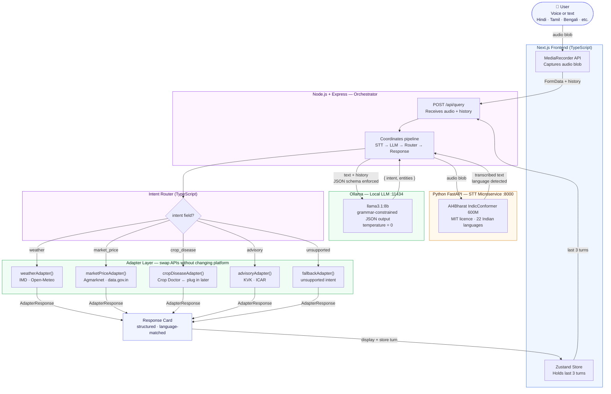

# inteLLm — Multilingual Agricultural Voice Assistant

> **Open-source · Fully offline · 22 Indian languages**  
> A microservice pipeline that turns a farmer's voice into structured, actionable agricultural intelligence — weather, mandi prices, crop disease diagnosis, and farming advisories.

---

## What is this?

**inteLLm** is a multilingual, voice-first agricultural assistant built entirely on open-source, MIT-licensed components. A farmer can speak a query in Hindi, Tamil, Bengali, Marathi, or any of the 22 officially recognized Indian languages. The system transcribes their voice, extracts a structured intent, and routes it to the right data source — all running locally, with no API keys and no usage costs.

This is a university research project demonstrating:
- **Microservice architecture** — Python STT service + Node.js orchestrator + Next.js frontend, each independently swappable
- **Grammar-constrained LLM decoding** — Ollama's token sampler is restricted to valid JSON at the token level, eliminating hallucination
- **Multilingual NLP** — AI4Bharat's IndicConformer, India's first open-source ASR covering all 22 scheduled languages (IIT Madras)
- **Adapter pattern** — mock adapters today, live APIs tomorrow, without touching the orchestrator or frontend

---

## Tech Stack

| Layer | Technology | License |
|-------|-----------|---------|
| **Speech-to-Text** | AI4Bharat IndicConformer-600M (HuggingFace + Python FastAPI) | MIT |
| **Intent LLM** | Ollama + `llama3.1:8b` or `qwen2.5:7b` (grammar-constrained JSON) | MIT / Apache 2.0 |
| **Orchestrator** | Node.js + Express | MIT |
| **Frontend** | Next.js + TypeScript + TailwindCSS | MIT |
| **State** | Zustand (last 3 conversation turns) | MIT |

---

## Architecture & Pipeline



### How the pipeline flows

1. **User speaks** (or types) in any Indian language. The browser's `MediaRecorder` captures a raw audio blob.
2. **Frontend** sends `FormData` (audio + last 3 conversation turns) to `POST /api/query` on the Express orchestrator.
3. **Orchestrator** forwards the audio blob to the **Python STT microservice** (`localhost:8000`).
4. **IndicConformer-600M** transcribes the audio and returns `{ text, language }`.
5. **Orchestrator** sends the text + conversation history to **Ollama** (`localhost:11434`) with a JSON Schema as the `format` field — this activates grammar-constrained decoding.
6. **Ollama** runs `llama3.1:8b` at temperature 0 and is physically constrained to output only tokens that continue a valid JSON document matching the schema. It returns `{ intent, entities }`.
7. **Intent Router** matches the `intent` field to the correct adapter function.
8. **Adapter** returns an `AdapterResponse` with structured data and a human-readable `display` string.
9. **Frontend** renders the Response Card and stores the turn in Zustand for the next query's context.

---

## Project Structure

```
inteLLm/
├── src/
│   ├── intentSchemas.ts    ← TypeScript types + JSON Schema + few-shot system prompt
│   ├── intentExtractor.ts  ← Calls Ollama, enforces schema, validates output, returns AgriIntent
│   ├── adapters.ts         ← Mock responses for each intent (swap for real APIs later)
│   ├── router.ts           ← Maps intent → correct adapter
│   └── tsconfig.json
├── tests/
│   └── runPipeline.ts      ← 20-query test suite (Hindi + English + Hinglish + edge cases)
├── stt_service/            ← [Phase 2] Python FastAPI STT microservice
├── server/                 ← [Phase 3] Express orchestrator
├── frontend/               ← [Phase 4] Next.js + Tailwind frontend
├── tracker.md              ← Build progress & what's left
├── PROJECT_ARCHITECTURE.md ← Full architecture reference
└── package.json
```

---

## How to Run — Phase 1 (Intent Pipeline, what's working now)

Phase 1 is self-contained: pure Node.js, no audio, no Python. It validates that the Ollama → schema-constrained JSON pipeline works before the voice layer is added.

### Prerequisites

**1. Node.js v20+**
```bash
node --version   # must be v20+
```

**2. Ollama**

Download from [https://ollama.com](https://ollama.com) (Windows, Mac, Linux all supported).

```bash
# Start the Ollama server (keep this terminal open)
ollama serve

# In a new terminal — pull the model (~4.7 GB, one-time download)
ollama pull llama3.1:8b
```

> **Low-spec machine?**  
> Use `ollama pull llama3.2:3b` (~2 GB, faster). Then set `OLLAMA_MODEL=llama3.2:3b` in your environment, or edit the constant in `src/intentExtractor.ts`.  
> Alternatively, `qwen2.5:7b` is recommended for better multilingual accuracy.

**3. Install Node dependencies**
```bash
npm install
```

### Run the test suite

```bash
# Make sure `ollama serve` is running in another terminal first!
npm test
```

Expected output:
```
╔════════════════════════════════════════╗
║   AGRI PLATFORM — Phase 1 Test Runner  ║
╚════════════════════════════════════════╝

Checking Ollama health...
✓ Ollama running · model: llama3.1:8b

  आज का मौसम कैसा रहेगा?                              ✓ [weather]       843ms
  Will it rain tomorrow in my village?               ✓ [weather]       612ms
  मुझे दिल्ली में गेहूं का भाव बताओ                  ✓ [market_price]  731ms
  ...

── Summary ──────────────────────────────────────
  Total:    20
  Passed:   18
  Failed:   2
  Accuracy: 90.0%
  Avg latency: 680ms

✓ Pipeline looks healthy. Ready for Phase 2 (STT integration).
```

**Target: ≥ 85% accuracy before moving to Phase 2.**

### Environment variables

| Variable | Default | Description |
|----------|---------|-------------|
| `OLLAMA_URL` | `http://localhost:11434` | Ollama server URL |
| `OLLAMA_MODEL` | `llama3.1:8b` | Model to use |

---

## How to Run — Phase 2 (STT Service) `[not built yet]`

```bash
# Will be in stt_service/ — Python FastAPI wrapping IndicConformer
cd stt_service
pip install -r requirements.txt
uvicorn main:app --host 0.0.0.0 --port 8000
```

---

## How to Run — Full Stack `[Phase 3 + 4, not built yet]`

```bash
# Terminal 1 — Ollama
ollama serve

# Terminal 2 — Python STT microservice
cd stt_service && uvicorn main:app --port 8000

# Terminal 3 — Express orchestrator
cd server && npm run dev

# Terminal 4 — Next.js frontend
cd frontend && npm run dev
# Open http://localhost:3000
```

---

## How Grammar-Constrained Decoding Works

This is the core technical contribution of the project. Instead of just prompting the LLM to "return JSON", we pass a full JSON Schema as the `format` field in the Ollama API request:

```typescript
body: JSON.stringify({
  model: "llama3.1:8b",
  messages: [...],
  format: INTENT_JSON_SCHEMA,   // ← the JSON Schema object, not just "json"
  options: { temperature: 0 },
})
```

Passing a JSON Schema (not just the string `"json"`) tells Ollama's token sampler to only ever emit tokens that are valid continuations of a document matching that schema. At token generation time, the sampler masks all tokens that would violate the schema. The model **cannot** produce `{"intent":"weather"} Here is the weather:` — the extra text is impossible given the grammar.

This is enforced at the **token level**, not the prompt level. It's not just an instruction the model might ignore — it's a hard constraint on what can be sampled.

---

## Adding a New Intent

Example: adding `soil_test`.

**1.** Add the TypeScript type in `src/intentSchemas.ts`:
```typescript
export type SoilTestIntent = {
  intent: "soil_test";
  entities: { location?: string; crop?: string };
};
```

**2.** Add to the `AgriIntent` union and the `enum` in `INTENT_JSON_SCHEMA`:
```typescript
enum: ["weather", "market_price", "crop_disease", "advisory", "soil_test", "unsupported"]
```

**3.** Add few-shot examples to `INTENT_SYSTEM_PROMPT`:
```
Input: "मेरी मिट्टी की जांच कहां होगी?"
Output: {"intent":"soil_test","entities":{"location":"local KVK"}}
```

**4.** Add an adapter function in `src/adapters.ts`.

**5.** Add a `case` in `src/router.ts`.

---

## Supported Intents

| Intent | Example query | Entities extracted |
|--------|-------------|-------------------|
| `weather` | "आज का मौसम कैसा रहेगा?" | `location`, `crop`, `timeframe` |
| `market_price` | "दिल्ली में गेहूं का भाव बताओ" | `crop`, `market`, `state` |
| `crop_disease` | "My tomato leaves are turning yellow" | `crop`, `symptom` |
| `advisory` | "धान की बुवाई कब करें?" | `crop`, `topic` |
| `unsupported` | "How do I fix my tractor engine?" | `message` (human-readable) |

---

## Supported Languages (Phase 2 onwards)

All 22 officially recognized Indian languages via AI4Bharat IndicConformer-600M:

Hindi · Tamil · Telugu · Kannada · Malayalam · Marathi · Gujarati · Bengali · Punjabi · Urdu · Odia · Assamese · Maithili · Konkani · Manipuri · Nepali · Santali · Sindhi · Sanskrit · Kashmiri · Dogri · Bodo

---

## Build Progress

See [`tracker.md`](./tracker.md) for the full phase-by-phase progress tracker with detailed checklists.

---

## Academic Value

| Criterion | Status |
|-----------|--------|
| Fully open-source (MIT/Apache 2.0) | ✅ |
| Microservice architecture | ✅ |
| Multilingual NLP (22 Indian languages) | ✅ |
| Grammar-constrained decoding (novel technique) | ✅ |
| IIT Madras-backed ASR model | ✅ |
| No API costs / fully offline | ✅ |

---

## License

MIT — see `LICENSE` file.

**Model licences:**
- IndicConformer-600M: MIT (AI4Bharat / IIT Madras)
- Llama 3.1: Meta Llama 3.1 Community License (free for research)
- Qwen2.5: Apache 2.0
